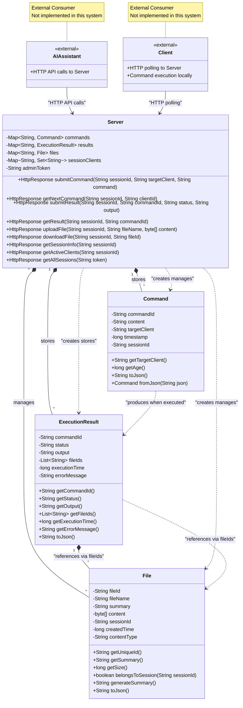

# DevOps 概念情境 OOA 類別圖設計

## 設計目標
將 `analysis/devops_concept_structured_analysis.md` 的結構化分析結果轉換為物件導向的類別圖設計，產出可實作的系統藍圖。

## 設計日期
2024-11-23

## 輸入來源
基於 `analysis/devops_concept_structured_analysis.md` 中的最終合併結構樹進行轉換。

---

# 結構化分析轉類別圖設計：DevOps 概念情境

## Step 1: 類別概念精煉結果

### 名詞分類歸屬

**原始名詞概念統計**：從結構化分析中提取了 67 個名詞概念

**最終組件設計**：

| 組件名稱 | 歸屬名詞概念 | 核心職責 | 組件類型 |
|---------|-------------|----------|----------|
| **Server** | Server、中央協調系統、中央系統 | HTTP API處理器和業務邏輯協調器 | 實作類別 |
| **Command** | 指令、command-id、執行模式、同步、非同步 | 指令的資料結構和狀態管理 | 資料結構 |
| **ExecutionResult** | 結果、執行結果、成功、錯誤 | 執行結果的資料結構 | 資料結構 |
| **File** | 檔案、file-id、摘要資訊、複雜的執行結果 | 檔案元數據和存儲管理 | 資料結構 |

**簡化的實作細節**：
- **Session** → sessionId (字串) - 作為 Client 的屬性，用於資源隔離
- **Queue** → 實作細節 - Server 內部如何管理待執行指令 (可用陣列、佇列、資料庫等)

**移除的外部角色和抽象概念**：
- **User**：維運工程師、DevOps工程師 → 系統外部的操作者，不屬於實作範圍
- **AIAssistant**：AI助手、AI大腦、AI端 → 系統的外部消費者，透過 HTTP API 使用我們的服務
- **Client**：Client端、client → 系統的外部消費者，透過 HTTP API 使用我們的服務
- **Environment**：遠端環境、本機環境、生產環境 → 拽象概念，Client運行的位置，不需要實作
- **Infrastructure**：機器、服務器、Web前端、API後端、資料庫服務器 → 實體資源，隱藏在Client內部，不屬於系統設計範圍
- **ExecutionMode**：執行模式、同步、非同步 → Command的屬性，不需要獨立類別
- **Communication**：HTTP polling機制、主動polling、polling → HTTP 協定實作細節，由 Server 提供 API 終點


---

## Step 2: 樹狀結構重組

使用核心組件重新建構的精簡架構：

```
public-tunnel Server 中心設計

Server (核心實作組件)
├── HTTP API 處理器 →
│   ├── 指令提交 API → 建立 Command 物件
│   ├── 結果查詢 API → 取得 ExecutionResult 物件
│   ├── 檔案管理 API → 上傳/下載 File 物件
│   └── Client Polling API → 分發儲存的 Command
├── 業務邏輯協調 →
│   ├── sessionId 隔離管理 
│   ├── FIFO 指令管理（實作細節）
│   ├── 同步/非同步模式切換
│   └── Client 狀態追蹤
└── 資料結構管理 →
    ├── Command (指令資料)
    ├── ExecutionResult (結果資料)
    └── File (檔案資料)

外部交互 (不在實作範圍)
├── AI助手 → 透過 HTTP API 使用 Server
└── Client 程式 → 透過 HTTP API 使用 Server
```

---

## Step 3: Server-centric 類別設計

基於系統邊界重新定義，本系統實作範圍聚焦於 Server 端服務，AIAssistant 和 Client 為外部消費者。

### 實作組件 (Implementation Component)

#### Server (核心服務器)
```java
class Server {
    // 核心屬性
    -Map<String, Command> commands          // 指令儲存 (key: commandId)
    -Map<String, ExecutionResult> results   // 結果儲存 (key: commandId)
    -Map<String, File> files                // 檔案管理 (key: fileId)
    -Map<String, Set<String>> sessionClients // Session 隔離 (key: sessionId, value: clientIds)
    -String adminToken                      // 管理員認證令牌 (從環境變數 PUBLIC_TUNNEL_ADMIN_TOKEN 讀取)
    -int syncTimeoutSeconds                 // 同步轉非同步閾值 (從環境變數 PUBLIC_TUNNEL_SYNC_TIMEOUT 讀取，預設 15 秒)
    
    // Core HTTP API Endpoints
    +HttpResponse submitCommand(String sessionId, String targetClient, String command)              // POST /api/session/{sessionId}/command (自動 sync->async 切換)
    +HttpResponse getNextCommand(String sessionId, String clientId)                                  // GET /api/session/{sessionId}/client/{clientId}/next-command  
    +HttpResponse submitResult(String sessionId, String commandId, String status, String output)    // POST /api/session/{sessionId}/result
    +HttpResponse getResult(String sessionId, String commandId)                                      // GET /api/session/{sessionId}/result/{commandId}
    +HttpResponse uploadFile(String sessionId, String fileName, byte[] content)                      // POST /api/session/{sessionId}/files
    +HttpResponse downloadFile(String sessionId, String fileId)                                     // GET /api/session/{sessionId}/files/{fileId}
    +HttpResponse getSessionInfo(String sessionId)                                                   // GET /api/session/{sessionId}
    +HttpResponse getActiveClients(String sessionId)                                                // GET /api/session/{sessionId}/clients
    +HttpResponse getAllSessions(String token)                                                      // GET /api/sessions (需 admin 權限)
}
```

#### Admin 認證機制

**環境變數設定**：
```bash
PUBLIC_TUNNEL_ADMIN_TOKEN=your-secret-admin-token-here
PUBLIC_TUNNEL_SYNC_TIMEOUT=15  # 同步轉非同步闾值（秒），預設 15 秒
```

**認證邏輯**：
```java
public HttpResponse getAllSessions(String token) {
    // 簡單字串比對環境變數
    if (!token.equals(this.adminToken)) {
        return HttpResponse.forbidden();  // 403 Forbidden
    }
    return HttpResponse.ok(getAllSessionsData());  // 回傳所有 session 清單
}
```

#### 自動 Sync-to-Async 切換機制

**切換邏輯**：
```java
public HttpResponse submitCommand(String sessionId, String targetClient, String command) {
    // 檢查 client 存在性和在線狀態
    if (!clientExists(sessionId, targetClient)) {
        return HttpResponse.badRequest("Client not found: " + targetClient);
    }
    if (!isClientOnline(sessionId, targetClient)) {
        return HttpResponse.badRequest("Client offline: " + targetClient);
    }
    
    // 建立 Command 並加入 queue
    String commandId = UUID.randomUUID().toString();
    Command cmd = new Command(commandId, command, targetClient, sessionId);
    addToQueue(sessionId, targetClient, cmd);
    
    // 同步等待結果，但有 timeout
    ExecutionResult result = waitForResult(commandId, this.syncTimeoutSeconds);
    
    if (result != null) {
        // 在時限內完成 -> 直接回傳結果
        return HttpResponse.ok(result);
    } else {
        // 超過時限 -> 轉為非同步模式
        return HttpResponse.ok(Map.of(
            "mode", "async",
            "command_id", commandId,
            "message", "Command execution timeout, switched to async mode"
        ));
    }
}
```

**設計特點**：
- **極簡設計**：單一環境變數，無需複雜的用戶管理系統
- **安全保障**：Token 在 Server 啟動時載入，運行期間不變動
- **部署簡單**：透過 Docker 或系統環境變數設定
- **權限單一**：只有一個管理員權限層級，符合極簡架構原則
- **智能切換**：自動檢測執行時間，無需 AI 預判斷任務類型
- **可配置**：timeout 闾值透過環境變數設定，適應不同部署環境

### 資料結構 (Data Structures)

#### Command (指令資料)
```java
class Command {
    // 核心屬性
    -String commandId           // 指令唯一識別
    -String content             // 指令內容
    -String targetClient        // 目標 Client
    -long timestamp             // 建立時間
    -String sessionId          // 所屬 Session
    
    // 資料操作
    +String getTargetClient()                  // 取得目標 Client
    +long getAge()                             // 取得指令年齡
    +String toJson()                           // 序列化為 JSON
    +Command fromJson(String json)             // 從 JSON 反序列化
}
```

#### ExecutionResult (執行結果資料)
```java
class ExecutionResult {
    // 純資料屬性
    -String commandId           // 對應指令ID
    -String status              // 執行狀態 (success/error/running)
    -String output              // 執行輸出內容
    -List<String> fileIds       // 附件檔案ID列表
    -long executionTime         // 執行時間戳記
    -String errorMessage        // 錯誤訊息 (如果有的話)
    
    // 基本存取器 (Getters/Setters only)
    +String getCommandId()
    +String getStatus()
    +String getOutput()
    +List<String> getFileIds()
    +long getExecutionTime()
    +String getErrorMessage()
    +String toJson()                           // 序列化為 JSON
}
```

#### File (檔案資料)
```java
class File {
    // 核心屬性
    -String fileId              // 檔案唯一ID
    -String fileName            // 檔案名稱
    -String summary             // 檔案摘要
    -byte[] content             // 檔案內容
    -String sessionId          // 所屬 Session
    -long createdTime           // 建立時間
    -String contentType         // 檔案類型
    
    // 資料操作
    +String getUniqueId()                      // 取得唯一ID
    +String getSummary()                       // 取得摘要
    +long getSize()                            // 取得檔案大小
    +boolean belongsToSession(String sessionId) // Session 歸屬檢查
    +String generateSummary()                  // 自動生成摘要
    +String toJson()                           // 序列化為 JSON (不含 content)
}
```


---

## Step 4: 關聯關係分析

### 聚合關係 (has-a, *--)

| 主類別 | 關係 | 從屬類別 | 多重性 | 關係描述 |
|-------|------|---------|--------|----------|
| Server | *-- | Command | 1 : * | Server 儲存多個待執行指令 |
| Server | *-- | ExecutionResult | 1 : * | Server 儲存多個執行結果 |
| Server | *-- | File | 1 : * | Server 管理多個檔案 |
| ExecutionResult | *-- | File | 1 : * | 執行結果可附帶多個檔案 (透過 fileIds) |

### 依賴關係 (uses, ..>)

| 使用者類別 | 關係 | 被使用類別 | 依賴描述 |
|-----------|------|------------|----------|
| Server | ..> | Command | Server 創建和管理 Command 物件 |
| Server | ..> | ExecutionResult | Server 創建和儲存 ExecutionResult 物件 |
| Server | ..> | File | Server 創建和管理 File 物件 |
| Command | ..> | ExecutionResult | Command 執行後產生 ExecutionResult |
| ExecutionResult | ..> | File | ExecutionResult 可關聯多個 File (透過 fileIds) |

### 多重性驗證 Checklist

**業務規則約束驗證**：
- [x] 一個 Server 可以儲存多個 Command (1:*) - 支援 getNextCommand() 查詢
- [x] 一個 Server 可以儲存多個 ExecutionResult (1:*)
- [x] 一個 Server 可以管理多個 File (1:*)
- [x] ExecutionResult 可以關聯多個 File 作為附件 (1:*)

**數據一致性驗證**：
- [x] Command 與 ExecutionResult 通過 commandId 建立關聯
- [x] File 與 Command 通過 sessionId 實現邏輯隔離
- [x] ExecutionResult 與 File 通過 fileIds 陣列建立關聯

**生命週期匹配性**：
- [x] Server 控制所有資料結構的生命週期
- [x] sessionId 作為字串屬性，用於跨資料結構的資源隔離
- [x] ExecutionResult 的生命週期獨立於 Command (用於歷史查詢)
- [x] 指令佇列管理留給實作時決定 (可用記憶體、資料庫、訊息佇列等)

---

## Step 5: Mermaid類別圖



---

## Step 6: 設計驗證

### 6.1 一致性檢查

- [x] **所有重要業務概念都有對應組件**
  - 3個核心組件完全涵蓋原始結構化分析中的重要概念
  - Server-centric 設計聚焦於實際實作範圍
  - Command, ExecutionResult, File 核心資料結構完整建模
  - Session 簡化為 sessionId 字串，作為資源隔離標識
  - Queue 作為實作細節，由 Server 內部管理

- [x] **方法覆蓋所有關鍵業務流程**
  - 指令提交流程：AIAssistant → Server.submitCommand() → Command 儲存並產生 commandId (自動同步等待 15 秒)
  - 指令執行流程：Client → Server.getNextCommand() → 取得 Command → 本地執行 → Server.submitResult(commandId)
  - 結果查詢流程：AIAssistant → Server.getResult(commandId) → 以 commandId 為 key 取得 ExecutionResult
  - 檔案管理流程：Client/AIAssistant → Server.uploadFile()/downloadFile() → File 管理
  - Session 協作流程：Server.getActiveClients() → 多 Client 協作資訊
  - 管理員流程：Admin → Server.getAllSessions(adminToken) → 系統全局 session 監控

- [x] **關聯關係反映真實的系統架構**
  - 聚合關係準確反映 Server 的資料管理職責
  - 依賴關係準確反映資料結構間的邏輯關聯
  - 多重性約束符合 Server-centric 架構需求

- [x] **多重性約束符合業務規則**
  - 1:* 關係：Server 管理多個 Command, ExecutionResult, File
  - 邏輯關聯：Command 與 ExecutionResult 透過 commandId 關聯，File 透過 fileIds 關聯
  - 所有約束都經過 Server-centric 架構驗證

### 6.2 設計品質評估

- [x] **職責單一性 (Single Responsibility)**
  - Server：專注於 HTTP API 處理、業務邏輯協調、資料結構管理
  - Command, ExecutionResult, File：各自專注於特定資料結構的屬性和操作
  - 每個組件都有明確且單一的核心職責

- [x] **低耦合 (Low Coupling)**
  - Server 作為唯一實作組件，透過 HTTP API 與外部消費者解耦
  - 資料結構間透過 ID 關聯而非直接引用
  - 避免跨資料結構的直接依賴，統一由 Server 協調
  - 外部消費者 (AIAssistant, Client) 僅透過 HTTP 協定與系統交互

- [x] **高內聚 (High Cohesion)**
  - Server 集中所有業務邏輯處理和資料管理功能
  - 每個資料結構包含完整的相關屬性和操作方法
  - ExecutionResult 包含所有執行結果相關的狀態和行為
  - sessionId 作為字串提供資源隔離標識

- [x] **可擴展性 (Extensibility)**
  - Server 的 HTTP API 設計支援新增不同類型的操作
  - 資料結構的 JSON 序列化支援版本演進
  - File 類別支援不同檔案類型和格式擴展
  - Session 隔離機制支援不同協作模式的擴展

### 6.3 架構完整性驗證

**核心架構模式驗證**：
- [x] **被動協調模式**：Server 僅響應 HTTP 請求，不主動發起操作
- [x] **FIFO 順序保證**：Server 內部實作確保 Command 先進先出執行
- [x] **會話隔離**：sessionId 字串標識提供完整的多專案/環境隔離
- [x] **檔案唯一識別**：File 資料結構支援 file-id 唯一性和重複處理

**業務流程完整性**：
- [x] **自動 Sync-to-Async 切換**：submitCommand() 自動檢測執行時間，超過 15 秒自動轉非同步
- [x] **Client 指令查詢機制**：getNextCommand() API 讓 Client 主動查詢待執行指令
- [x] **多客戶端協作**：getActiveClients() 支援多個 Client 在同一 session 內協作
- [x] **檔案管理和傳輸**：uploadFile()/downloadFile() 支援雙向檔案傳輸

---

## 總結

### 轉換成功驗證
✅ **概念完整性**：67個原始名詞概念成功歸納為4個核心組件 (Server + 3個資料結構 + sessionId字串)
✅ **系統邊界清晰**：Server-centric 設計聚焦於實際實作範圍，外部消費者透過 HTTP API 交互
✅ **架構一致性**：Server-centric 設計完全符合原始 public-tunnel 技術規格
✅ **實作可行性**：具體的 HTTP API 方法和資料結構定義可直接用於開發

### 極簡架構設計價值
通過持續簡化和重新定義，我們達成了：

1. **實作聚焦**：最終精簡為1個實作組件 + 3個資料結構
2. **職責清晰**：Server 承擔所有業務邏輯，資料結構純化為資料載體
3. **Session 簡化**：從複雜物件簡化為字串ID，作為資源隔離標識
4. **直接映射**：每個組件直接對應資料庫表和 HTTP API endpoint

### 方法論價值證明
這個 Server-centric OOA 設計成功完成了從「使用者情境」→「結構化分析」→「系統邊界定義」→「實作藍圖」的完整轉換鏈：

1. **情境還原** (`docs/04_devops_concept.md`)：將 technical specs 轉為 user scenarios
2. **結構化分析** (`analysis/devops_concept_structured_analysis.md`)：從 scenarios 提取概念結構  
3. **系統邊界定義**：識別實作範圍與外部消費者邊界
4. **Server-centric 設計** (本文件)：從概念結構推導實際可實作的系統架構

### 後續應用指引
此極簡 Server-centric OOA 設計可作為：
- **開發藍圖**：直接指導 public-tunnel server 的程式實作
- **API 設計**：9個 HTTP API 方法直接對應 REST endpoint 設計
- **資料庫設計**：3個資料結構直接映射為資料庫表，sessionId 作為隔離欄位
- **測試設計**：基於 Server API 方法設計 API 測試和單元測試
- **部署指南**：單一 Server 組件，最簡化的部署和維運

整個方法論鏈得到完整驗證，極簡 Server-centric 設計方法展現了從複雜概念到實用架構的完整轉換能力。