# DevOps 概念情境 OOA 類別圖設計

## 設計目標
將 `analysis/devops_concept_structured_analysis.md` 的結構化分析結果轉換為物件導向的類別圖設計，產出可實作的系統藍圖。

## 設計日期
2024-11-23

## 輸入來源
基於 `analysis/devops_concept_structured_analysis.md` 中的最終合併結構樹進行轉換。

---

# 結構化分析轉類別圖設計：DevOps 概念情境

## Step 1: 類別概念精煉結果

### 名詞分類歸屬

**原始名詞概念統計**：從結構化分析中提取了 67 個名詞概念

**建立分類體系**（13個主要類別）：

| 類別名稱 | 歸屬名詞概念 | 核心職責 |
|---------|-------------|----------|
| **User** | 維運工程師、DevOps工程師 | 使用者操作和問題解決 |
| **AIAssistant** | AI助手、AI大腦、AI端 | 智能分析和指令管理 |
| **Client** | Client端、client | 遠端環境的代理執行 |
| **Server** | Server、中央協調系統、中央系統 | 被動協調和資源管理 |
| **Command** | 指令、command-id | 執行指令的封裝和追蹤 |
| **ExecutionResult** | 結果、執行結果、成功、錯誤 | 執行結果的管理和狀態 |
| **File** | 檔案、file-id、摘要資訊、複雜的執行結果 | 檔案存儲和傳輸管理 |
| **Session** | session、session空間、不同的session | 會話隔離和協作空間 |
| **Queue** | command queue、FIFO command queue、專屬queue | 指令佇列和順序管理 |
| **Environment** | 遠端環境、本機環境、生產環境、環境資訊 | 執行環境的抽象和管理 |
| **Infrastructure** | 機器、服務器、Web前端、API後端、資料庫服務器 | 基礎設施的抽象表示 |
| **ExecutionMode** | 執行模式、同步、非同步 | 執行策略和模式控制 |
| **Communication** | HTTP polling機制、主動polling、polling | 通訊協定和連線管理 |

### 微小概念剔除分析

**剔除的微小概念**（17個）：
- 調查過程 → 用 User.analyzeProblems() 方法表示
- 資料複製貼上 → 用 User.switchEnvironments() 方法表示  
- Context Switch問題 → 用 User.hasContextSwitchProblem() 狀態表示
- 人肉資料搬運工 → 用 User 的狀態屬性表示
- 關鍵斷點 → 用系統架構設計表示
- 瓶頸 → 用 Communication.isConnectionActive() 屬性表示
- 自動化情境收集循環 → 用整體系統行為表示
- AI建議/AI執行 → 用 ExecutionMode 類別表示
- 長時間任務 → 用 Command.exceedsThreshold() 屬性表示
- 存在證明 → 用 Client.startPolling() 方法表示
- 網路斷線 → 用 Client.isConnected() 狀態表示
- 被動協調方式 → 用 Server.isPassiveMode() 設計模式表示
- 即時連線 → 用 Communication 配置表示
- 過程 → 用類別間的方法調用表示
- 設定門檻 → 用 ExecutionMode.timeoutThreshold 常數表示
- 完全隔離 → 用 Session.isolateFromOthers() 架構設計表示
- 唯一識別 → 用各類別的 ID 屬性表示

**保留原則驗證**：所有影響業務邏輯、系統架構或數據結構的概念均已保留在13個核心類別中。

---

## Step 2: 樹狀結構重組

使用類別概念重新建構的精簡樹狀結構：

```
User (維運工程師)
├── 工作流程管理 →
│   ├── Infrastructure (基礎設施)
│   │   └── 監控管理 → Environment (環境)
│   ├── AIAssistant (AI助手)  
│   │   └── 協作互動 → ExecutionResult (執行結果)
│   └── 問題解決流程 →
│       ├── 資料收集 → File (檔案)
│       └── 修正執行 → Command (指令)
└── 痛點識別 →
    └── 自動化需求 → Communication (通訊)

AIAssistant (AI助手)
├── 指令管理 →
│   ├── Command (指令)
│   │   └── 生成送出 → Client (客戶端)
│   └── ExecutionMode (執行模式)
│       └── 選擇控制 → Server (伺服器)
├── 結果處理 →
│   ├── ExecutionResult (執行結果)
│   │   └── 分析追蹤 → Session (會話)
│   └── File (檔案)
│       └── 管理操作 → Environment (環境)
└── 會話協調 →
    └── Session (會話)
        └── 空間管理 → Queue (佇列)

Client (客戶端)
├── 通訊機制 →
│   ├── Communication (通訊)
│   │   └── 主動polling → Server (伺服器)
│   └── Queue (佇列)
│       └── 指令獲取 → Command (指令)
├── 執行處理 →
│   ├── Command (指令)
│   │   └── 本機執行 → Environment (環境)
│   └── ExecutionResult (執行結果)
│       └── 結果回報 → File (檔案)
└── 協作模式 →
    └── Session (會話)
        └── 多客戶協作 → Infrastructure (基礎設施)

Server (伺服器)
├── 會話管理 →
│   ├── Session (會話)
│   │   └── 隔離提供 → User (使用者)
│   └── Queue (佇列)
│       └── 維護分發 → ExecutionMode (執行模式)
├── 指令協調 →
│   ├── Command (指令)
│   │   └── 佇列放入 → Communication (通訊)
│   └── ExecutionResult (執行結果)
│       └── 索引儲存 → File (檔案)
└── 檔案服務 →
    └── File (檔案)
        └── 上傳下載管理 → Environment (環境)
```

---

## Step 3: 獨立類別設計

### User (使用者)
```java
class User {
    // 屬性（從關係推導）
    -String userId
    -String role
    -List<Environment> environments
    -boolean hasContextSwitchProblem
    
    // 方法（從動詞轉換）
    +void faceProblems(Infrastructure infrastructure)     // 面對問題
    +void checkServers(List<Infrastructure> servers)      // 檢查服務器
    +void analyzeProblems(AIAssistant assistant)          // 分析問題
    +void executeCorrections(List<Command> commands)      // 執行修正
    +void switchEnvironments(Environment from, Environment to) // 切換環境
    +boolean hasContextSwitchProblem()                    // 狀態檢查
    +void collaborateWith(AIAssistant assistant)          // 協作
}
```

### AIAssistant (AI助手)
```java
class AIAssistant {
    // 屬性（從關係推導）
    -String assistantId
    -List<String> capabilities
    -ExecutionMode currentMode
    -boolean canDirectAccess
    
    // 方法（從動詞轉換）
    +Command createCommand(String content, String targetClient)    // 創建指令
    +ExecutionMode selectExecutionMode(Command command)           // 選擇執行模式
    +ExecutionResult trackExecution(String commandId)             // 追蹤執行
    +File manageFile(String fileId, String operation)             // 管理檔案
    +Session manageSession(String sessionId)                      // 管理會話
    +void analyzeEnvironment(Environment environment)             // 分析環境
    +boolean canDirectlyAccess(Environment environment)           // 存取能力檢查
    +void submitToServer(Server server, Command command)          // 提交指令
}
```

### Client (客戶端)
```java
class Client {
    // 屬性（從關係推導）
    -String clientId
    -Environment localEnvironment
    -Queue commandQueue
    -boolean isOnline
    -Communication communication
    
    // 方法（從動詞轉換）
    +void startPolling(Server server)                        // 開始 polling
    +Command retrieveCommand(Queue queue)                    // 取得指令
    +ExecutionResult executeCommand(Command command)         // 執行指令
    +void reportResult(ExecutionResult result, Server server) // 回報結果
    +void handleFileOperation(File file, String operation)   // 檔案操作
    +void reconnectOnFailure()                               // 重新連線
    +boolean isConnected()                                   // 連線狀態檢查
    +void collaborateInSession(Session session)              // 會話協作
}
```

### Server (伺服器)
```java
class Server {
    // 屬性（從關係推導）
    -String serverId
    -Map<String, Session> sessions
    -Map<String, Queue> clientQueues
    -Communication communicationMode
    -boolean passiveMode
    
    // 方法（從動詞轉換）
    +Session createSession(String sessionId)                          // 創建會話
    +void isolateSession(Session session)                             // 隔離會話
    +void distributeCommand(Command command, String targetClient)     // 分發指令
    +ExecutionResult storeResult(String commandId, ExecutionResult result) // 儲存結果
    +File manageSessionFile(String sessionId, String fileId)          // 管理會話檔案
    +void maintainFIFOOrder(Queue queue)                             // 維護 FIFO 順序
    +boolean isPassiveMode()                                          // 被動模式檢查
    +void respondToRequest(Object request)                            // 響應請求
}
```

### Command (指令)
```java
class Command {
    // 屬性（從關係推導）
    -String commandId
    -String content
    -String targetClient
    -ExecutionMode mode
    -long timestamp
    -long executionTime
    
    // 方法（從動詞轉換）
    +boolean isSync()                                    // 同步模式檢查
    +boolean isAsync()                                   // 非同步模式檢查
    +void switchToAsync()                                // 切換到非同步
    +String getTargetClient()                            // 取得目標客戶端
    +boolean exceedsThreshold(long threshold)            // 超過門檻檢查
    +ExecutionResult execute(Environment environment)    // 執行指令
    +void submitTo(Server server)                        // 提交到服務器
}
```

### ExecutionResult (執行結果)
```java
class ExecutionResult {
    // 屬性（從關係推導）
    -String commandId
    -String status
    -String content
    -List<File> attachedFiles
    -long executionTime
    -boolean isError
    
    // 方法（從動詞轉換）
    +boolean isCompleted()                    // 完成狀態檢查
    +boolean isSuccess()                      // 成功狀態檢查
    +boolean isError()                        // 錯誤狀態檢查
    +List<File> getFiles()                    // 取得附件檔案
    +String getSummary()                      // 取得摘要
    +boolean isComplex()                      // 複雜結果檢查
    +void reportTo(Server server)             // 回報到服務器
}
```

### File (檔案)
```java
class File {
    // 屬性（從關係推導）
    -String fileId
    -String fileName
    -String summary
    -byte[] content
    -String sessionId
    -boolean isDuplicate
    
    // 方法（從動詞轉換）
    +String getUniqueId()                           // 取得唯一ID
    +String getSummary()                            // 取得摘要
    +boolean isDuplicate(String fileName)           // 重複檢查
    +void upload(byte[] content)                    // 上傳
    +byte[] download()                              // 下載
    +boolean belongsToSession(String sessionId)     // 會話歸屬檢查
    +void managedBy(AIAssistant assistant)          // 被AI助手管理
}
```

### Session (會話)
```java
class Session {
    // 屬性（從關係推導）
    -String sessionId
    -List<String> clientIds
    -Map<String, File> files
    -boolean isolated
    -boolean supportsCollaboration
    
    // 方法（從動詞轉換）
    +void addClient(String clientId)              // 添加客戶端
    +void removeClient(String clientId)           // 移除客戶端
    +boolean isClientAllowed(String clientId)     // 客戶端權限檢查
    +void isolateFromOthers()                     // 從其他會話隔離
    +File storeFile(File file)                    // 儲存檔案
    +List<String> getActiveClients()              // 取得活躍客戶端
    +boolean supportsCollaboration()              // 協作支援檢查
    +void managedBy(Server server)                // 被服務器管理
}
```

### Queue (佇列)
```java
class Queue {
    // 屬性（從關係推導）
    -String queueId
    -LinkedList<Command> commands
    -String ownerId
    -boolean fifoOrder
    -int maxSize
    
    // 方法（從動詞轉換）
    +void enqueue(Command command)                // 入隊
    +Command dequeue()                            // 出隊
    +boolean isEmpty()                            // 空佇列檢查
    +void maintainFIFO()                         // 維護 FIFO 順序
    +int getSize()                               // 取得佇列大小
    +boolean belongsToClient(String clientId)    // 客戶端歸屬檢查
    +void maintainedBy(Server server)            // 被服務器維護
}
```

### Environment (環境)
```java
class Environment {
    // 屬性（從關係推導）
    -String environmentId
    -String type
    -Map<String, String> systemStatus
    -List<Infrastructure> infrastructure
    -boolean isRemote
    -boolean isAccessible
    
    // 方法（從動詞轉換）
    +Map<String, String> collectInformation()           // 收集資訊
    +boolean isAccessible()                             // 可存取性檢查
    +void updateStatus(Map<String, String> status)      // 更新狀態
    +List<Infrastructure> getInfrastructure()           // 取得基礎設施
    +boolean isRemote()                                 // 遠端檢查
    +void executeIn(Command command)                    // 在環境中執行
}
```

### Infrastructure (基礎設施)
```java
class Infrastructure {
    // 屬性（從關係推導）
    -String serverId
    -String serverType
    -String status
    -Environment environment
    -boolean requiresSSH
    
    // 方法（從動詞轉換）
    +boolean isOnline()                           // 線上狀態檢查
    +String checkSystemStatus()                   // 檢查系統狀態
    +void executeCommand(Command command)         // 執行指令
    +String getServerType()                       // 取得服務器類型
    +boolean requiresSSH()                        // SSH 需求檢查
    +void monitoredBy(User user)                  // 被使用者監控
}
```

### ExecutionMode (執行模式)
```java
class ExecutionMode {
    // 屬性（從關係推導）
    -String modeName
    -long timeoutThreshold
    -boolean autoSwitch
    -boolean isSync
    -boolean isAsync
    
    // 方法（從動詞轉換）
    +boolean isSync()                                        // 同步模式檢查
    +boolean isAsync()                                       // 非同步模式檢查
    +boolean shouldAutoSwitch(long executionTime)            // 自動切換判斷
    +String determineMode(Command command)                   // 決定執行模式
    +void configureThreshold(long threshold)                 // 配置門檻
    +void selectedBy(AIAssistant assistant)                  // 被AI助手選擇
}
```

### Communication (通訊)
```java
class Communication {
    // 屬性（從關係推導）
    -String protocol
    -int pollingInterval
    -boolean isPollingBased
    -boolean isConnectionActive
    -boolean supportsPassiveMode
    
    // 方法（從動詞轉換）
    +void startPolling()                          // 開始 polling
    +void stopPolling()                           // 停止 polling
    +boolean isConnectionActive()                 // 連線活躍檢查
    +void handleDisconnection()                   // 處理斷線
    +void sendHeartbeat()                         // 發送心跳
    +boolean supportsPassiveMode()                // 被動模式支援檢查
    +void usedBy(Client client)                   // 被客戶端使用
    +void usedBy(Server server)                   // 被服務器使用
}
```

---

## Step 4: 關聯關係分析

### 聚合關係 (has-a, *--)

| 主類別 | 關係 | 從屬類別 | 多重性 | 關係描述 |
|-------|------|---------|--------|----------|
| User | *-- | Environment | 1 : * | 使用者管理多個環境 |
| AIAssistant | *-- | ExecutionMode | 1 : 1 | AI助手持有當前執行模式 |
| Client | *-- | Queue | 1 : 1 | 客戶端擁有專屬指令佇列 |
| Server | *-- | Session | 1 : * | 伺服器管理多個會話 |
| Session | *-- | File | 1 : * | 會話包含多個檔案 |
| Queue | *-- | Command | 1 : * | 佇列儲存多個指令 |
| ExecutionResult | *-- | File | 1 : * | 執行結果包含附件檔案 |
| Environment | *-- | Infrastructure | 1 : * | 環境包含多個基礎設施 |

### 依賴關係 (uses, ..>)

| 使用者類別 | 關係 | 被使用類別 | 依賴描述 |
|-----------|------|------------|----------|
| User | ..> | AIAssistant | 使用者使用AI助手協作分析 |
| AIAssistant | ..> | Server | AI助手使用伺服器提交指令 |
| Client | ..> | Server | 客戶端使用伺服器進行polling |
| AIAssistant | ..> | Command | AI助手創建和管理指令 |
| Client | ..> | Command | 客戶端執行指令 |
| Command | ..> | ExecutionResult | 指令執行產生結果 |
| Server | ..> | Communication | 伺服器使用通訊協定 |
| Client | ..> | Communication | 客戶端使用通訊協定 |
| ExecutionResult | ..> | Server | 執行結果回報到伺服器 |
| File | ..> | AIAssistant | 檔案被AI助手管理 |

### 多重性驗證 Checklist

**業務規則約束驗證**：
- [x] 一個使用者可以管理多個環境 (1:*)
- [x] 一個AI助手在同一時間只能有一個執行模式 (1:1)
- [x] 每個客戶端有自己專屬的指令佇列 (1:1)
- [x] 一個伺服器可以管理多個隔離的會話 (1:*)

**數據一致性驗證**：
- [x] 指令與執行結果通過 commandId 建立關聯
- [x] 檔案與會話通過 sessionId 建立關聯
- [x] 客戶端與佇列通過 ownerId 建立關聯

**生命週期匹配性**：
- [x] Session 的生命週期包含其內部的 File
- [x] Queue 的生命週期與其 Client 一致
- [x] ExecutionResult 的生命週期獨立於 Command

---

## Step 5: Mermaid類別圖

```mermaid
classDiagram
    class User {
        -String userId
        -String role
        -List~Environment~ environments
        -boolean hasContextSwitchProblem
        +void faceProblems(Infrastructure infrastructure)
        +void checkServers(List~Infrastructure~ servers)
        +void analyzeProblems(AIAssistant assistant)
        +void executeCorrections(List~Command~ commands)
        +void switchEnvironments(Environment from, Environment to)
        +boolean hasContextSwitchProblem()
        +void collaborateWith(AIAssistant assistant)
    }
    
    class AIAssistant {
        -String assistantId
        -List~String~ capabilities
        -ExecutionMode currentMode
        -boolean canDirectAccess
        +Command createCommand(String content, String targetClient)
        +ExecutionMode selectExecutionMode(Command command)
        +ExecutionResult trackExecution(String commandId)
        +File manageFile(String fileId, String operation)
        +Session manageSession(String sessionId)
        +void analyzeEnvironment(Environment environment)
        +boolean canDirectlyAccess(Environment environment)
        +void submitToServer(Server server, Command command)
    }
    
    class Client {
        -String clientId
        -Environment localEnvironment
        -Queue commandQueue
        -boolean isOnline
        -Communication communication
        +void startPolling(Server server)
        +Command retrieveCommand(Queue queue)
        +ExecutionResult executeCommand(Command command)
        +void reportResult(ExecutionResult result, Server server)
        +void handleFileOperation(File file, String operation)
        +void reconnectOnFailure()
        +boolean isConnected()
        +void collaborateInSession(Session session)
    }
    
    class Server {
        -String serverId
        -Map~String, Session~ sessions
        -Map~String, Queue~ clientQueues
        -Communication communicationMode
        -boolean passiveMode
        +Session createSession(String sessionId)
        +void isolateSession(Session session)
        +void distributeCommand(Command command, String targetClient)
        +ExecutionResult storeResult(String commandId, ExecutionResult result)
        +File manageSessionFile(String sessionId, String fileId)
        +void maintainFIFOOrder(Queue queue)
        +boolean isPassiveMode()
        +void respondToRequest(Object request)
    }
    
    class Command {
        -String commandId
        -String content
        -String targetClient
        -ExecutionMode mode
        -long timestamp
        -long executionTime
        +boolean isSync()
        +boolean isAsync()
        +void switchToAsync()
        +String getTargetClient()
        +boolean exceedsThreshold(long threshold)
        +ExecutionResult execute(Environment environment)
        +void submitTo(Server server)
    }
    
    class ExecutionResult {
        -String commandId
        -String status
        -String content
        -List~File~ attachedFiles
        -long executionTime
        -boolean isError
        +boolean isCompleted()
        +boolean isSuccess()
        +boolean isError()
        +List~File~ getFiles()
        +String getSummary()
        +boolean isComplex()
        +void reportTo(Server server)
    }
    
    class File {
        -String fileId
        -String fileName
        -String summary
        -byte[] content
        -String sessionId
        -boolean isDuplicate
        +String getUniqueId()
        +String getSummary()
        +boolean isDuplicate(String fileName)
        +void upload(byte[] content)
        +byte[] download()
        +boolean belongsToSession(String sessionId)
        +void managedBy(AIAssistant assistant)
    }
    
    class Session {
        -String sessionId
        -List~String~ clientIds
        -Map~String, File~ files
        -boolean isolated
        -boolean supportsCollaboration
        +void addClient(String clientId)
        +void removeClient(String clientId)
        +boolean isClientAllowed(String clientId)
        +void isolateFromOthers()
        +File storeFile(File file)
        +List~String~ getActiveClients()
        +boolean supportsCollaboration()
        +void managedBy(Server server)
    }
    
    class Queue {
        -String queueId
        -LinkedList~Command~ commands
        -String ownerId
        -boolean fifoOrder
        -int maxSize
        +void enqueue(Command command)
        +Command dequeue()
        +boolean isEmpty()
        +void maintainFIFO()
        +int getSize()
        +boolean belongsToClient(String clientId)
        +void maintainedBy(Server server)
    }
    
    class Environment {
        -String environmentId
        -String type
        -Map~String, String~ systemStatus
        -List~Infrastructure~ infrastructure
        -boolean isRemote
        -boolean isAccessible
        +Map~String, String~ collectInformation()
        +boolean isAccessible()
        +void updateStatus(Map~String, String~ status)
        +List~Infrastructure~ getInfrastructure()
        +boolean isRemote()
        +void executeIn(Command command)
    }
    
    class Infrastructure {
        -String serverId
        -String serverType
        -String status
        -Environment environment
        -boolean requiresSSH
        +boolean isOnline()
        +String checkSystemStatus()
        +void executeCommand(Command command)
        +String getServerType()
        +boolean requiresSSH()
        +void monitoredBy(User user)
    }
    
    class ExecutionMode {
        -String modeName
        -long timeoutThreshold
        -boolean autoSwitch
        -boolean isSync
        -boolean isAsync
        +boolean isSync()
        +boolean isAsync()
        +boolean shouldAutoSwitch(long executionTime)
        +String determineMode(Command command)
        +void configureThreshold(long threshold)
        +void selectedBy(AIAssistant assistant)
    }
    
    class Communication {
        -String protocol
        -int pollingInterval
        -boolean isPollingBased
        -boolean isConnectionActive
        -boolean supportsPassiveMode
        +void startPolling()
        +void stopPolling()
        +boolean isConnectionActive()
        +void handleDisconnection()
        +void sendHeartbeat()
        +boolean supportsPassiveMode()
        +void usedBy(Client client)
        +void usedBy(Server server)
    }
    
    %% 聚合關係 (has-a)
    User "1" *-- "*" Environment : manages
    AIAssistant "1" *-- "1" ExecutionMode : uses
    Client "1" *-- "1" Queue : owns
    Server "1" *-- "*" Session : manages
    Session "1" *-- "*" File : contains
    Queue "1" *-- "*" Command : stores
    ExecutionResult "1" *-- "*" File : includes
    Environment "1" *-- "*" Infrastructure : contains
    
    %% 依賴關係 (uses)
    User ..> AIAssistant : collaborates
    AIAssistant ..> Server : submits_commands
    Client ..> Server : polls
    AIAssistant ..> Command : creates
    Client ..> Command : executes
    Command ..> ExecutionResult : produces
    Server ..> Communication : uses
    Client ..> Communication : uses
    ExecutionResult ..> Server : reports_to
    File ..> AIAssistant : managed_by
```



---

## Step 6: 設計驗證

### 6.1 一致性檢查

- [x] **所有重要業務概念都有對應類別**
  - 13個核心類別完全涵蓋原始結構化分析中的重要概念
  - User, AIAssistant, Client, Server 三角協作模式完整實現
  - Command, ExecutionResult, File 核心業務對象完整建模

- [x] **方法覆蓋所有關鍵業務流程**
  - 指令創建到執行的完整流程：AIAssistant.createCommand() → Server.distributeCommand() → Client.executeCommand() → ExecutionResult.reportTo()
  - 檔案管理流程：File.upload() → Session.storeFile() → AIAssistant.manageFile() → File.download()
  - 會話協作流程：Server.createSession() → Session.addClient() → Client.collaborateInSession()

- [x] **關聯關係反映真實的對象交互**
  - 聚合關係準確反映生命週期依賴
  - 依賴關係準確反映方法調用關係
  - 多重性約束符合業務邏輯需求

- [x] **多重性約束符合業務規則**
  - 1:* 關係：User-Environment, Server-Session, Session-File 等
  - 1:1 關係：AIAssistant-ExecutionMode, Client-Queue
  - 所有約束都經過業務規則驗證

### 6.2 設計品質評估

- [x] **職責單一性 (Single Responsibility)**
  - User：專注使用者操作和問題解決流程
  - AIAssistant：專注智能分析和指令管理
  - Client：專注遠端執行和通訊
  - Server：專注被動協調和資源管理
  - 每個類別都有明確且單一的核心職責

- [x] **低耦合 (Low Coupling)**
  - 使用依賴注入模式（如 AIAssistant 透過參數接收 Server）
  - 避免直接實例化依賴對象
  - 介面抽象化通訊機制（Communication 類別）
  - 類別間主要通過方法參數進行交互

- [x] **高內聚 (High Cohesion)**
  - 相關屬性和方法集中在同一類別
  - ExecutionResult 包含所有結果相關的狀態和行為
  - Session 包含所有會話相關的管理功能
  - Queue 包含所有佇列操作的完整實現

- [x] **可擴展性 (Extensibility)**
  - ExecutionMode 支援新增不同的執行策略
  - Communication 支援新增不同的通訊協定
  - File 類別支援不同檔案類型和格式
  - Infrastructure 支援不同類型的基礎設施

### 6.3 架構完整性驗證

**核心架構模式驗證**：
- [x] **被動協調模式**：Server 類別實現被動響應設計
- [x] **FIFO 順序保證**：Queue 類別確保先進先出
- [x] **會話隔離**：Session 類別提供完整隔離機制
- [x] **檔案唯一識別**：File 類別支援 file-id 唯一性

**業務流程完整性**：
- [x] **同步/非同步執行模式**：ExecutionMode 和 Command 類別支援
- [x] **HTTP Polling 機制**：Communication 類別實現
- [x] **多客戶端協作**：Session 和 Client 類別支援
- [x] **檔案摘要和選擇性下載**：File 和 AIAssistant 類別支援

---

## 總結

### 轉換成功驗證
✅ **概念完整性**：67個原始名詞概念成功歸納為13個核心類別
✅ **關係準確性**：樹狀結構中的動詞關係準確轉換為類別方法和關聯
✅ **架構一致性**：OOA設計完全符合原始public-tunnel技術規格
✅ **實作可行性**：具體的方法簽名和屬性定義可直接用於開發

### 方法論價值證明
這個OOA設計成功完成了從「使用者情境」→「結構化分析」→「類別圖設計」的完整轉換鏈：

1. **情境還原** (`docs/04_devops_concept.md`)：將technical specs轉為user scenarios
2. **結構化分析** (`analysis/devops_concept_structured_analysis.md`)：從scenarios提取概念結構  
3. **OOA設計** (本文件)：從概念結構推導實作藍圖

### 後續應用指引
此OOA設計可作為：
- **開發藍圖**：直接指導public-tunnel系統的程式實作
- **架構驗證**：確保實作符合原始需求和使用者情境  
- **測試設計**：基於類別方法設計單元測試和整合測試
- **文檔基準**：作為系統文檔和API設計的參考基準

整個方法論鏈得到完整驗證，可成功應用於其他技術系統的分析和設計。