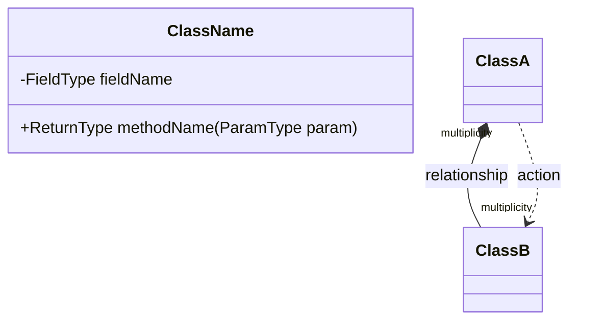

# 結構化分析轉類別圖設計

## 目標
將完成結構化分析的樹狀結構轉換為物件導向的類別圖設計，包含獨立類別定義、方法分析、關聯關係建立，最終產出完整的UML類別圖。

## 執行步驟

### Step 1: 類別概念精煉
**目的**：從結構化分析中提取適合OOA的核心類別概念

#### 1.1 名詞分類歸屬
1. **收集所有名詞**：從樹狀結構中提取所有名詞概念
2. **建立分類體系**：
   - 尋找能概括多個名詞的代表性概念作為類別候選
   - 如無適合候選，建立新的類別名稱
   - 建立13-15個主要類別（根據系統複雜度調整）
3. **名詞歸屬**：將所有名詞明確歸屬到相應類別下
4. **識別例外**：標記無法分類的名詞，評估其是否為屬性或需進一步分析

#### 1.2 微小概念剔除
**剔除標準**：不影響核心功能實作的概念
- **數量描述類**：用常數或變數表示（如"16張卡牌" → `TOTAL_CARDS = 16`）
- **狀態限定詞**：用對象屬性表示（如"移除的卡牌" → `card.isRemoved`）
- **時間序列指示詞**：用索引或狀態機表示（如"下一局" → `roundNumber + 1`）
- **特定狀態限定詞**：用條件判斷表示（如"2人玩家" → `playerCount == 2`）
- **位置和方向描述**：用演算法或索引表示（如"牌庫頂" → `deck[0]`）

**保留原則**：影響業務邏輯、系統架構或數據結構的概念必須保留

### Step 2: 樹狀結構重組
**目的**：使用精煉後的類別概念重新建構樹狀結構

#### 2.1 重組規則
- 使用類別概念替代具體實例
- 保持原有的主謂賓動作關係
- 將相同類別的多個概念合併為單一節點
- 建立清晰的層次結構（階段 → 流程 → 動作）

#### 2.2 輸出格式
```
主要類別 (ClassName)
├── 子階段 →
│   ├── 相關類別 (RelatedClass)
│   │   └── 動作關係 → 目標類別 (TargetClass)
│   └── 條件分支 →
│       ├── 情況A → 結果類別 (ResultClass)
│       └── 情況B → 結果類別 (ResultClass)
└── 其他關係 →
```

### Step 3: 獨立類別設計
**目的**：為每個類別定義完整的方法簽名

#### 3.1 方法提取規則
**動詞識別**：從樹狀結構中找出每個類別承接的動詞
- **主動動詞**：類別作為主詞執行的動作
- **被動動詞**：類別作為受詞接受的動作
- **狀態動詞**：類別內部狀態的變化

#### 3.2 方法設計規範
```java
class ClassName {
    // 屬性（從關係推導）
    -FieldType fieldName
    
    // 方法（從動詞轉換）
    +ReturnType methodName(ParameterType parameter)  // 動詞 → 參數對象
    +boolean isCondition()                           // 狀態檢查
    +void setState()                                 // 狀態設定  
    +Type getCalculatedValue()                       // 計算類方法
}
```

#### 3.3 參數推導規則
- **動詞的受詞** = 方法參數類型
- **集合操作** = `List<Type>` 參數
- **數量相關** = `int` 參數
- **設定相關** = 設定類參數

### Step 4: 關聯關係建立
**目的**：根據樹狀結構的動詞關係建立類別間的UML關聯

#### 4.1 關係類型判斷
**has-a 關係（聚合 *--）**：
- 對象內部**持續持有**另一個對象的引用
- 對象生命週期內穩定存在
- 範例：Game持有Player、Player持有Card

**uses 關係（依賴 ..>）**：
- 對象間的**瞬時交互**，通常是方法調用
- 臨時的功能依賴
- 範例：Player使用Deck抽牌、Card觸發GameMechanism

#### 4.2 多重性設計規範
```
"1"      : 恰好一個
"0..1"   : 零或一個  
"1..*"   : 一個或多個
"2..4"   : 2到4個（具體範圍）
"*"      : 零個或多個
```

#### 4.3 多重性驗證checklist
- **業務規則約束**：是否符合領域邏輯？
- **數據一致性**：數量關係是否合理？
- **生命週期**：對象存在期間是否匹配？
- **狀態變化**：動態變化範圍是否正確？

### Step 5: Mermaid類別圖生成
**目的**：產出可視化的UML類別圖

#### 5.1 Mermaid語法規範


#### 5.2 圖表組織原則
- **屬性在前，方法在後**
- **公有方法用+，私有屬性用-**
- **關係標籤簡潔明確**
- **多重性標記準確**

### Step 6: 設計驗證
**目的**：確保類別圖的正確性和完整性

#### 6.1 一致性檢查
- [ ] 所有重要業務概念都有對應類別
- [ ] 方法覆蓋所有關鍵業務流程  
- [ ] 關聯關係反映真實的對象交互
- [ ] 多重性約束符合業務規則

#### 6.2 設計品質評估
- [ ] **職責單一性**：每個類別有明確職責
- [ ] **低耦合**：類別間依賴最小化
- [ ] **高內聚**：類別內部邏輯緊密
- [ ] **可擴展性**：支持未來功能擴展

## 輸出格式要求

### 完整輸出結構
```
## Step 1: 類別概念精煉結果
### 名詞分類歸屬
[13-15個主要類別的完整歸屬表]

### 微小概念剔除分析  
[剔除32個微小概念，保留18個核心概念的對照表]

## Step 2: 樹狀結構重組
[使用類別概念的精簡樹狀結構]

## Step 3: 獨立類別設計
[每個類別的完整方法簽名]

## Step 4: 關聯關係分析
[詳細的關係類型判斷和多重性設計]

## Step 5: Mermaid類別圖
[完整的可視化類別圖代碼]

## Step 6: 設計驗證
[一致性檢查和品質評估結果]
```

## 使用指引
1. **輸入**：完成結構化分析的樹狀結構
2. **執行**：按照6個步驟順序執行
3. **輸出**：完整的UML類別圖設計文件

此prompt確保從結構化分析到類別圖設計的完整、系統化轉換過程，適用於任何領域的系統分析。