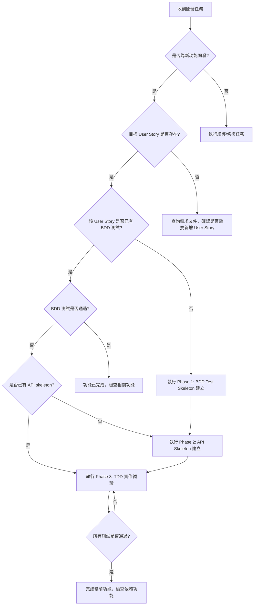

# Public-Tunnel AI 助手非互動模式開發指南

## 文件目的
此文件定義 AI 助手在非互動模式下執行開發任務的完整工作流程，包含決策邏輯、文件參考順序，以及不同開發階段的具體操作指引。

## 環境準備

### Git Worktree 設定
AI 助手在開始任何開發工作前，必須建立獨立的 worktree 環境：

```bash
# 建立新的 worktree 用於功能開發
git worktree add ../public-tunnel-dev-{feature-name} feature/{branch-name}
cd ../public-tunnel-dev-{feature-name}

# 範例：開發 US-003 功能
git worktree add ../public-tunnel-dev-us003 feature/us003-session-auto-join
cd ../public-tunnel-dev-us003
```

### Python 虛擬環境設定
每個 worktree 都必須建立獨立的虛擬環境：

```bash
# 建立虛擬環境
python -m venv venv

# 啟用虛擬環境 (Linux/macOS)
source venv/bin/activate

# 啟用虛擬環境 (Windows)
# venv\Scripts\activate

# 安裝專案依賴（開發模式 + 測試依賴）
pip install -e ".[test]"

# 驗證安裝
pytest --version
python -c "import public_tunnel; print('Installation successful')"
```

### 環境驗證檢查清單
在開始開發前，AI 助手必須確認：
- [ ] Git worktree 已正確建立並切換
- [ ] Python 虛擬環境已啟用 (提示符顯示 `(venv)`)
- [ ] 專案依賴已安裝完成 (`pip install -e ".[test]"`)
- [ ] 測試框架可正常運作 (`pytest --version`)
- [ ] 專案可正常匯入 (`python -c "import public_tunnel"`)

## 工作流程概覽

### 執行模式判斷
AI 助手在接到開發任務時，應依序檢查以下條件來決定執行策略：



### 階段性工作流程

#### Phase 0: 環境準備與任務理解
**觸發條件**：收到開發任務
**環境設定**：
1. 建立 git worktree 並切換到新的工作目錄
2. 建立並啟用 Python 虛擬環境
3. 安裝專案依賴 (`pip install -e ".[test]"`)
4. 驗證環境設定正確

**必讀文件順序**：
1. `docs/development/01_feature_dependency_matrix.md` - 確認功能相依性
2. `docs/requirements/02_user_story.md` - 理解目標 User Story
3. `docs/design/03_ooa_design.md` - 理解系統架構

**執行動作**：
1. 識別目標 User Story 及其 ID
2. 檢查功能相依性，確認前置功能是否已完成
3. 建立當前開發會話的執行計劃

#### Phase 1: BDD Test Skeleton 建立
**觸發條件**：目標 User Story 尚無對應的 BDD 測試
**執行 prompt**：`@prompts/01_user-story-to-bdd-skeleton.md.prompt`
**參考文件**：
- `docs/requirements/02_user_story.md` - User Story 詳細定義
- `conftest.py` - ScenarioContext 架構
- `tests/features/` - 現有測試結構參考

**執行環境要求**：
- 必須在已啟用的 venv 環境中執行
- 確認 pytest-bdd 已正確安裝

**完成標準**：
- 建立對應的 `.feature` 文件
- 建立基礎的 step definitions
- 測試可執行但失敗（Red 狀態）
- 所有測試指令都在 venv 內執行

#### Phase 2: API Skeleton 建立
**觸發條件**：BDD 測試存在但 API 實作不存在
**執行 prompt**：`@prompts/02_api-skeleton-creation.md.prompt`
**參考文件**：
- `docs/design/03_ooa_design.md` - API 設計規格
- `public_tunnel/models/` - 資料模型定義
- `public_tunnel/routers/` - 路由結構

**執行環境要求**：
- 必須在已啟用的 venv 環境中執行
- 確認所有開發依賴已安裝

**完成標準**：
- API endpoints 已建立但僅回傳基本響應
- 資料模型已定義
- 基礎路由設定完成
- 可在 venv 環境中啟動和測試 API

#### Phase 3: TDD 實作循環
**觸發條件**：API skeleton 存在但功能未完整實作
**執行 prompt**：`@prompts/03_tdd-implementation-cycle.md.prompt`
**參考文件**：
- `prompts/04_python-coding-style.md.prompt` - 編碼風格規範
- `public_tunnel/dependencies/providers.py` - 依賴注入架構

**執行環境要求**：
- 必須在已啟用的 venv 環境中執行
- 所有測試和程式執行都在 venv 內完成

**完成標準**：
- 所有 BDD 測試通過（Green 狀態）
- 程式碼符合專案編碼風格
- 功能完整實作
- 所有測試都在 venv 環境中通過

#### Phase 4: 最終審查與整合
**觸發條件**：功能實作完成，準備提交
**執行 prompt**：`@prompts/05_final-commit-review.md.prompt`

**執行環境要求**：
- 在 venv 環境中執行最終測試
- 確認所有依賴正確安裝

**完成標準**：
- 所有相關測試在 venv 環境中通過
- 程式碼審查完成
- 準備好進行 commit 和 merge back

## 決策邏輯規則

### 1. 功能相依性檢查
在開始任何功能開發前，必須檢查 `docs/development/01_feature_dependency_matrix.md`：
- 如果前置功能未完成，優先開發前置功能
- 如果存在循環依賴，報告錯誤並要求人工介入

### 2. 並行開發策略
某些功能可以並行開發，識別條件：
- 功能間無直接依賴關係
- 不共用相同的 API endpoints
- 不修改相同的資料模型

### 3. 錯誤處理與回退
當遭遇以下情況時，應停止自動執行：
- BDD 測試無法建立（User Story 定義不清）
- API 設計與現有架構衝突
- 測試持續失敗超過 3 次循環
- 依賴注入配置出現錯誤

## 非互動模式執行命令

### 基本語法
```bash
# 開發特定 User Story
ai-dev --story US-001

# 開發多個相關功能
ai-dev --stories US-001,US-002,US-003

# 從特定階段開始
ai-dev --story US-001 --from-phase 2

# 執行完整的功能模組
ai-dev --module session-management
```

### 執行參數說明
- `--story`: 指定目標 User Story ID
- `--stories`: 指定多個 User Story ID，用逗號分隔
- `--from-phase`: 從指定階段開始執行（1-4）
- `--module`: 執行預定義的功能模組
- `--dry-run`: 僅顯示執行計劃，不實際執行
- `--verbose`: 輸出詳細執行日誌

## 狀態追蹤與報告

### 進度追蹤文件
AI 助手應維護以下文件來追蹤開發進度：
- `docs/development/progress_tracking.md` - 總體進度報告
- `docs/development/current_session.md` - 當前開發會話狀態
- `docs/development/blocked_features.md` - 受阻功能列表

### 完成度評估
每個功能的完成度分為以下等級：
- **Not Started** (0%): 尚未開始開發
- **BDD Created** (25%): BDD 測試已建立
- **API Skeleton** (50%): API 骨架已建立
- **Implementation** (75%): 功能實作中
- **Completed** (100%): 所有測試通過，功能完成

## 與現有工作流程整合

此非互動模式完全相容於現有的 prompt-based 工作流程：
- 使用相同的 prompt 文件
- 遵循相同的 BDD 開發方法
- 維持相同的程式碼品質標準
- 整合既有的依賴注入架構

唯一差異是決策過程自動化，減少人工介入的需求。