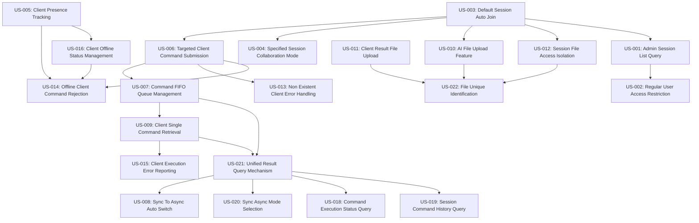

# Public-Tunnel 功能相依性矩陣與開發順序

## 文件目的
定義 22 個 User Stories 間的相依關係，建立最佳化的開發順序，確保 AI 助手能以正確的順序進行功能開發。

## User Stories 分類

### 基礎設施層 (Infrastructure Layer)
這些功能提供系統運作的基本能力，必須優先開發：

| ID | 名稱 | 核心職責 | 優先級 |
|----|------|----------|--------|
| US-003 | Default Session Auto Join | Client 自動加入預設 session | P0 |
| US-005 | Client Presence Tracking | Server 追蹤 client 線上狀態 | P0 |
| US-016 | Client Offline Status Management | 離線狀態管理機制 | P0 |

### 核心業務層 (Core Business Layer)
基於基礎設施層，實作核心的指令執行功能：

| ID | 名稱 | 核心職責 | 優先級 |
|----|------|----------|--------|
| US-006 | Targeted Client Command Submission | AI 提交指令給特定 client | P1 |
| US-007 | Command FIFO Queue Management | 指令佇列 FIFO 管理 | P1 |
| US-009 | Client Single Command Retrieval | Client 單次取得一個指令 | P1 |
| US-021 | Unified Result Query Mechanism | 統一的結果查詢機制 | P1 |

### 進階功能層 (Advanced Features Layer)
在核心功能穩定後，增加進階特性：

| ID | 名稱 | 核心職責 | 優先級 |
|----|------|----------|--------|
| US-004 | Specified Session Collaboration Mode | 指定 session 的協作模式 | P2 |
| US-008 | Sync To Async Auto Switch | 同步自動切換非同步 | P2 |
| US-020 | Sync Async Mode Selection | AI 選擇同步/非同步模式 | P2 |

### 錯誤處理層 (Error Handling Layer)
確保系統穩定性的錯誤處理機制：

| ID | 名稱 | 核心職責 | 優先級 |
|----|------|----------|--------|
| US-013 | Non Existent Client Error Handling | 不存在 client 的錯誤處理 | P2 |
| US-014 | Offline Client Command Rejection | 離線 client 指令拒絕 | P2 |
| US-015 | Client Execution Error Reporting | Client 執行錯誤回報 | P2 |

### 檔案管理層 (File Management Layer)
檔案上傳下載功能，可與核心功能並行開發：

| ID | 名稱 | 核心職責 | 優先級 |
|----|------|----------|--------|
| US-010 | AI File Upload Feature | AI 上傳檔案功能 | P2 |
| US-011 | Client Result File Upload | Client 結果檔案上傳 | P2 |
| US-012 | Session File Access Isolation | Session 檔案存取隔離 | P2 |
| US-022 | File Unique Identification | 檔案唯一識別機制 | P2 |

### 查詢與監控層 (Query & Monitoring Layer)
系統狀態查詢和監控功能：

| ID | 名稱 | 核心職責 | 優先級 |
|----|------|----------|--------|
| US-018 | Command Execution Status Query | 指令執行狀態查詢 | P3 |
| US-019 | Session Command History Query | Session 指令歷史查詢 | P3 |

### 權限管理層 (Permission Management Layer)
管理員權限相關功能，可最後實作：

| ID | 名稱 | 核心職責 | 優先級 |
|----|------|----------|--------|
| US-001 | Admin Session List Query | 管理員 session 列表查詢 | P3 |
| US-002 | Regular User Access Restriction | 一般使用者存取限制 | P3 |

## 相依性關係矩陣

### 直接相依關係

### 相依性說明

**P0 → P1 相依**：
- US-003 → US-006: 必須先能建立 session，才能提交指令
- US-005 → US-014: 必須先能追蹤 client 狀態，才能拒絕離線 client

**P1 內部相依**：
- US-006 → US-007: 指令提交後需要佇列管理
- US-007 → US-009: 佇列管理後 client 才能取得指令
- US-009 → US-021: Client 執行後需要統一的結果查詢

**P1 → P2 相依**：
- US-021 → US-008: 統一結果機制後才能實作同步轉非同步
- US-006 → US-013/US-014: 指令提交後才需要錯誤處理

**P2 → P3 相依**：
- US-021 → US-018/US-019: 統一結果機制後才能實作進階查詢

## 開發順序規劃

### Phase A: 系統基石 (Week 1-2)
**目標**：建立基本的 session 和 client 管理能力

**開發順序**：
1. **US-003**: Default Session Auto Join
2. **US-005**: Client Presence Tracking  
3. **US-016**: Client Offline Status Management

**並行度**: 序列開發，US-003 → US-005 → US-016

**完成標準**：
- Client 可以自動加入預設 session
- Server 可以追蹤 client 線上/離線狀態
- 離線 client 會被正確標記

### Phase B: 核心指令流程 (Week 3-4)
**目標**：實作完整的指令提交→執行→結果查詢流程

**開發順序**：
1. **US-006**: Targeted Client Command Submission
2. **US-007**: Command FIFO Queue Management
3. **US-009**: Client Single Command Retrieval
4. **US-021**: Unified Result Query Mechanism

**並行度**: 主要序列開發，US-021 可與 US-009 部分並行

**完成標準**：
- AI 可以提交指令給特定 client
- 指令以 FIFO 順序處理
- Client 可以取得並執行指令
- 可以查詢指令執行結果

### Phase C: 錯誤處理與檔案管理 (Week 5-6)
**目標**：增加系統穩定性和檔案傳輸能力

**群組 C1 - 錯誤處理**：
1. **US-013**: Non Existent Client Error Handling
2. **US-014**: Offline Client Command Rejection  
3. **US-015**: Client Execution Error Reporting

**群組 C2 - 檔案管理**：
1. **US-010**: AI File Upload Feature
2. **US-012**: Session File Access Isolation
3. **US-011**: Client Result File Upload
4. **US-022**: File Unique Identification

**並行度**: C1 和 C2 群組可完全並行開發

### Phase D: 進階功能 (Week 7-8)
**目標**：增加系統彈性和協作能力

**開發順序**：
1. **US-004**: Specified Session Collaboration Mode
2. **US-020**: Sync Async Mode Selection
3. **US-008**: Sync To Async Auto Switch

**並行度**: US-004 可與 US-020 並行，US-008 依賴 US-020

### Phase E: 監控與管理 (Week 9-10)
**目標**：完善系統監控和權限管理

**群組 E1 - 查詢功能**：
1. **US-018**: Command Execution Status Query
2. **US-019**: Session Command History Query

**群組 E2 - 權限管理**：
1. **US-001**: Admin Session List Query
2. **US-002**: Regular User Access Restriction

**並行度**: E1 和 E2 群組可完全並行開發

## 風險評估與緩解策略

### 高風險相依關係
1. **US-003 → US-006**: Session 管理是所有功能的基礎
   - **緩解**: 優先完成 US-003，確保穩定後再進行其他開發
   
2. **US-021 → US-008**: 結果查詢機制影響同步轉非同步功能
   - **緩解**: 確保 US-021 的 API 設計考慮異步需求

### 並行開發機會
1. **檔案管理群組 (C2)**: 與錯誤處理群組 (C1) 無相依性
2. **權限管理群組 (E2)**: 與查詢功能群組 (E1) 無相依性

### 測試策略
- **每個 Phase 結束進行整合測試**
- **Phase B 結束後進行端到端測試**
- **關鍵路徑功能 (US-003, US-006, US-021) 需額外測試**

## AI 助手執行指引

### 自動相依性檢查
AI 助手在開始開發任何 User Story 前，必須檢查：
1. 所有前置 User Story 是否已完成
2. 是否存在循環相依（應報告錯誤）
3. 是否可與其他功能並行開發

### 狀態追蹤
維護每個 User Story 的狀態：
- `blocked`: 等待前置功能完成
- `ready`: 可以開始開發
- `in_progress`: 開發中
- `testing`: 測試中
- `completed`: 已完成

### 優先級調整規則
如果遇到阻塞，AI 助手應：
1. 檢查是否有其他相同優先級的功能可以開發
2. 報告阻塞狀況並建議解決方案
3. 在必要時調整開發順序（需要記錄原因）